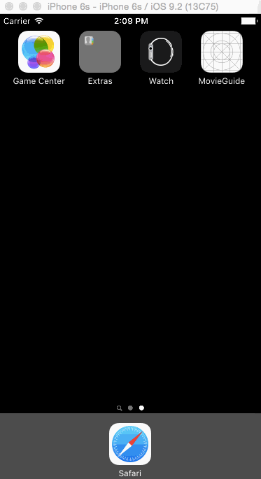

# MovieGuide

##Description:
A movie guide app written in Swift as a tutorial project for MobileSpace. This app was built to learn the concepts of making API calls and displaying that data within the app. API calls were made using Alamofire and AlamofireImage was used to display images.

##Demo:

